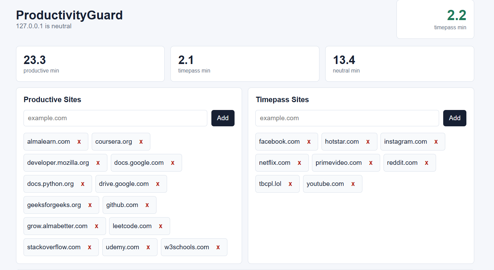

# ProductivityGuard

ProductivityGuard is a personal browser productivity tracker. It runs a local Flask dashboard/API and a Chrome/Brave extension. Productive sites earn timepass minutes, timepass sites consume them, and distracting sites are blocked when the balance reaches zero.

## Dashboard




## Run the Local App

```powershell
pip install -r requirements.txt
python main.py
```

Open the dashboard:

```text
http://127.0.0.1:5000
```

## Load the Extension

1. Open Chrome or Brave.
2. Go to `chrome://extensions`.
3. Enable Developer mode.
4. Click **Load unpacked**.
5. Select the `extension` folder from this project.

Keep `python main.py` running while you browse. The extension sends active-tab heartbeats to the local app.


## Dashboard Features

- Weekly study hours line chart for the last 7 days.
- Weekly productive, timepass, and neutral hour totals.
- Daily checklist for 8 recurring habits.
- Task completion summary for today and the last 7 days.


## Reward Rules

- 6 productive minutes earn 1 timepass minute.
- 4 productive hours in a day grants a one-time 20 minute bonus.
- Unused timepass minutes carry over, capped at 120 minutes.
- Tracking pauses after 5 minutes of browser inactivity.
